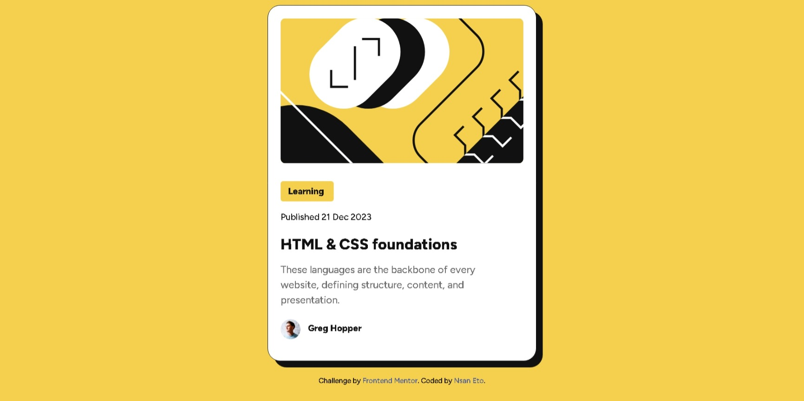

# Frontend Mentor - Blog preview card solution

This is a solution to the [Blog preview card challenge on Frontend Mentor](https://www.frontendmentor.io/challenges/blog-preview-card-ckPaj01IcS). Frontend Mentor challenges help you improve your coding skills by building realistic projects.

## Table of contents

- [Frontend Mentor - Blog preview card solution](#frontend-mentor---blog-preview-card-solution)
  - [Table of contents](#table-of-contents)
  - [Overview](#overview)
    - [The challenge](#the-challenge)
    - [Screenshot](#screenshot)
    - [Links](#links)
  - [My process](#my-process)
    - [Built with](#built-with)
    - [AI Collaboration](#ai-collaboration)
  - [Author](#author)

## Overview

### The challenge

Users should be able to:

- See hover and focus states for all interactive elements on the page

### Screenshot

### Links

- Solution URL: [Frontend Mentor Solution](https://www.frontendmentor.io/solutions/blog-preview-card-EpUOnFg9mM)
- Live Site URL: [Blog preview card](https://ulrichneud.github.io/blog-card/)

## My process

### Built with

- Semantic HTML5 markup
- CSS custom properties

### AI Collaboration

I used AI to know how to use @media for design different screen types

## Author

- Website - [Nsan Eto](https://github.com/ulrichneud)
- Frontend Mentor - [@ulrichneud](https://www.frontendmentor.io/profile/ulrichneud)

